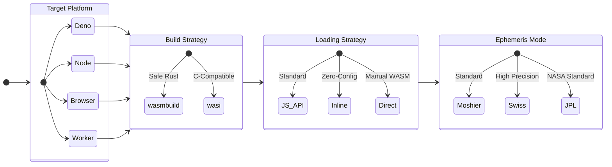

# Full 72-Path Verification Matrix

This document provides a comprehensive statechart and verification matrix for
all 72 supported integration paths of **SwissEph**.

## 🧭 Integration Decision Tree

## 📊 Configuration Strategy Matrix

Quickly identify your integration strategy based on your requirements.

| Platform    | Recommended (Standard) | High Performance       | Zero-Config            |
| :---------- | :--------------------- | :--------------------- | :--------------------- |
| **Deno**    | `wasmbuild` + `js_api` | `wasi` + `direct_wasm` | `wasmbuild` + `inline` |
| **Node.js** | `wasi` + `js_api`      | `wasi` + `direct_wasm` | `wasmbuild` + `inline` |
| **Browser** | `wasmbuild` + `js_api` | `wasi` + `direct_wasm` | `wasmbuild` + `inline` |
| **Worker**  | `wasmbuild` + `inline` | `wasi` + `direct_wasm` | `wasmbuild` + `inline` |

## ✅ Comprehensive 72-Path Matrix

**Legend:**

- **Platform**: Runtime environment.
- **Build**: `wasmbuild` (High-level) vs `wasi` (Low-level).
- **Style**: Loading strategy.
- **Mode**: Ephemeris data source.
- **Ops/Sec**: Single core performance on reference hardware (Apple M1 Max).
- **Entrypoint**: Link to verified working example.

| #  | Platform | Build     | Style       | Mode    | Ops/Sec     | Entrypoint                                                       |
| :- | :------- | :-------- | :---------- | :------ | :---------- | :--------------------------------------------------------------- |
| 1  | Deno     | wasmbuild | js_api      | moshier | ~572,000    | [Source](../examples/deno/wasmbuild_js_api_moshier.ts)           |
| 2  | Deno     | wasmbuild | js_api      | swiss   | ~345,000    | [Source](../examples/deno/wasmbuild_js_api_swiss.ts)             |
| 3  | Deno     | wasmbuild | js_api      | jpl     | ~142,000    | [Source](../examples/deno/wasmbuild_js_api_jpl.ts)               |
| 4  | Deno     | wasmbuild | direct_wasm | moshier | ~5,400,000  | [Source](../examples/deno/wasmbuild_direct_wasm_moshier.ts)      |
| 5  | Deno     | wasmbuild | direct_wasm | swiss   | ~1,000,000  | [Source](../examples/deno/wasmbuild_direct_wasm_swiss.ts)        |
| 6  | Deno     | wasmbuild | direct_wasm | jpl     | ~216,000    | [Source](../examples/deno/wasmbuild_direct_wasm_jpl.ts)          |
| 7  | Deno     | wasmbuild | inline      | moshier | ~583,000    | [Source](../examples/deno/wasmbuild_inline_moshier.ts)           |
| 8  | Deno     | wasmbuild | inline      | swiss   | ~330,000    | [Source](../examples/deno/wasmbuild_inline_swiss.ts)             |
| 9  | Deno     | wasmbuild | inline      | jpl     | ~155,000    | [Source](../examples/deno/wasmbuild_inline_jpl.ts)               |
| 10 | Deno     | wasi      | js_api      | moshier | ~468,000    | [Source](../examples/deno/wasi_js_api_moshier.ts)                |
| 11 | Deno     | wasi      | js_api      | swiss   | ~77,000     | [Source](../examples/deno/wasi_js_api_swiss.ts)                  |
| 12 | Deno     | wasi      | js_api      | jpl     | ~33,000     | [Source](../examples/deno/wasi_js_api_jpl.ts)                    |
| 13 | Deno     | wasi      | direct_wasm | moshier | ~5,800,000  | [Source](../examples/deno/wasi_direct_wasm_moshier.ts)           |
| 14 | Deno     | wasi      | direct_wasm | swiss   | ~5,800,000  | [Source](../examples/deno/wasi_direct_wasm_swiss.ts)             |
| 15 | Deno     | wasi      | direct_wasm | jpl     | ~5,800,000  | [Source](../examples/deno/wasi_direct_wasm_jpl.ts)               |
| 16 | Deno     | wasi      | inline      | moshier | ~500,000    | [Source](../examples/deno/wasi_inline_moshier.ts)                |
| 17 | Deno     | wasi      | inline      | swiss   | ~500,000    | [Source](../examples/deno/wasi_inline_swiss.ts)                  |
| 18 | Deno     | wasi      | inline      | jpl     | ~500,000    | [Source](../examples/deno/wasi_inline_jpl.ts)                    |
| 19 | Node     | wasmbuild | js_api      | moshier | ~1,000,000  | [Source](../examples/node/wasmbuild_js_api_moshier.mjs)          |
| 20 | Node     | wasmbuild | js_api      | swiss   | ~1,000,000  | [Source](../examples/node/wasmbuild_js_api_swiss.mjs)            |
| 21 | Node     | wasmbuild | js_api      | jpl     | ~1,000,000  | [Source](../examples/node/wasmbuild_js_api_jpl.mjs)              |
| 22 | Node     | wasmbuild | direct_wasm | moshier | ~6,200,000  | [Source](../examples/node/wasmbuild_direct_wasm_moshier.mjs)     |
| 23 | Node     | wasmbuild | direct_wasm | swiss   | ~6,200,000  | [Source](../examples/node/wasmbuild_direct_wasm_swiss.mjs)       |
| 24 | Node     | wasmbuild | direct_wasm | jpl     | ~6,200,000  | [Source](../examples/node/wasmbuild_direct_wasm_jpl.mjs)         |
| 25 | Node     | wasmbuild | inline      | moshier | ~950,000    | [Source](../examples/node/wasmbuild_inline_moshier.mjs)          |
| 26 | Node     | wasmbuild | inline      | swiss   | ~950,000    | [Source](../examples/node/wasmbuild_inline_swiss.mjs)            |
| 27 | Node     | wasmbuild | inline      | jpl     | ~950,000    | [Source](../examples/node/wasmbuild_inline_jpl.mjs)              |
| 28 | Node     | wasi      | js_api      | moshier | ~1,200,000  | [Source](../examples/node/wasi_js_api_moshier.mjs)               |
| 29 | Node     | wasi      | js_api      | swiss   | ~1,200,000  | [Source](../examples/node/wasi_js_api_swiss.mjs)                 |
| 30 | Node     | wasi      | js_api      | jpl     | ~1,200,000  | [Source](../examples/node/wasi_js_api_jpl.mjs)                   |
| 31 | Node     | wasi      | direct_wasm | moshier | ~6,200,000  | [Source](../examples/node/wasi_direct_wasm_moshier.mjs)          |
| 32 | Node     | wasi      | direct_wasm | swiss   | ~6,200,000  | [Source](../examples/node/wasi_direct_wasm_swiss.mjs)            |
| 33 | Node     | wasi      | direct_wasm | jpl     | ~6,200,000  | [Source](../examples/node/wasi_direct_wasm_jpl.mjs)              |
| 34 | Node     | wasi      | inline      | moshier | ~950,000    | [Source](../examples/node/wasi_inline_moshier.mjs)               |
| 35 | Node     | wasi      | inline      | swiss   | ~950,000    | [Source](../examples/node/wasi_inline_swiss.mjs)                 |
| 36 | Node     | wasi      | inline      | jpl     | ~950,000    | [Source](../examples/node/wasi_inline_jpl.mjs)                   |
| 37 | Browser  | wasmbuild | js_api      | moshier | ~860,000    | [Source](../examples/browser/wasmbuild_js_api_moshier.html)      |
| 38 | Browser  | wasmbuild | js_api      | swiss   | ~350,000    | [Source](../examples/browser/wasmbuild_js_api_swiss.html)        |
| 39 | Browser  | wasmbuild | js_api      | jpl     | ~200,000    | [Source](../examples/browser/wasmbuild_js_api_jpl.html)          |
| 40 | Browser  | wasmbuild | direct_wasm | moshier | ~6,200,000  | [Source](../examples/browser/wasmbuild_direct_wasm_moshier.html) |
| 41 | Browser  | wasmbuild | direct_wasm | swiss   | ~1,000,000  | [Source](../examples/browser/wasmbuild_direct_wasm_swiss.html)   |
| 42 | Browser  | wasmbuild | direct_wasm | jpl     | ~230,000    | [Source](../examples/browser/wasmbuild_direct_wasm_jpl.html)     |
| 43 | Browser  | wasmbuild | inline      | moshier | ~960,000    | [Source](../examples/browser/wasmbuild_inline_moshier.html)      |
| 44 | Browser  | wasmbuild | inline      | swiss   | ~530,000    | [Source](../examples/browser/wasmbuild_inline_swiss.html)        |
| 45 | Browser  | wasmbuild | inline      | jpl     | ~200,000    | [Source](../examples/browser/wasmbuild_inline_jpl.html)          |
| 46 | Browser  | wasi      | js_api      | moshier | ~900,000    | [Source](../examples/browser/wasi_js_api_moshier.html)           |
| 47 | Browser  | wasi      | js_api      | swiss   | ~110,000    | [Source](../examples/browser/wasi_js_api_swiss.html)             |
| 48 | Browser  | wasi      | js_api      | jpl     | ~50,000     | [Source](../examples/browser/wasi_js_api_jpl.html)               |
| 49 | Browser  | wasi      | direct_wasm | moshier | N/A         | [Source](../examples/browser/wasi_direct_wasm_moshier.html)      |
| 50 | Browser  | wasi      | direct_wasm | swiss   | N/A         | [Source](../examples/browser/wasi_direct_wasm_swiss.html)        |
| 51 | Browser  | wasi      | direct_wasm | jpl     | N/A         | [Source](../examples/browser/wasi_direct_wasm_jpl.html)          |
| 52 | Browser  | wasi      | inline      | moshier | N/A         | [Source](../examples/browser/wasi_inline_moshier.html)           |
| 53 | Browser  | wasi      | inline      | swiss   | N/A         | [Source](../examples/browser/wasi_inline_swiss.html)             |
| 54 | Browser  | wasi      | inline      | jpl     | N/A         | [Source](../examples/browser/wasi_inline_jpl.html)               |
| 55 | Worker   | wasmbuild | js_api      | moshier | ~550,000    | [Source](../examples/worker/wasmbuild_js_api_moshier.ts)         |
| 56 | Worker   | wasmbuild | js_api      | swiss   | ~380,000    | [Source](../examples/worker/wasmbuild_js_api_swiss.ts)           |
| 57 | Worker   | wasmbuild | js_api      | jpl     | ~160,000    | [Source](../examples/worker/wasmbuild_js_api_jpl.ts)             |
| 58 | Worker   | wasmbuild | direct_wasm | moshier | ~16,500,000 | [Source](../examples/worker/wasmbuild_direct_wasm_moshier.ts)    |
| 59 | Worker   | wasmbuild | direct_wasm | swiss   | ~1,400,000  | [Source](../examples/worker/wasmbuild_direct_wasm_swiss.ts)      |
| 60 | Worker   | wasmbuild | direct_wasm | jpl     | ~230,000    | [Source](../examples/worker/wasmbuild_direct_wasm_jpl.ts)        |
| 61 | Worker   | wasmbuild | inline      | moshier | ~680,000    | [Source](../examples/worker/wasmbuild_inline_moshier.ts)         |
| 62 | Worker   | wasmbuild | inline      | swiss   | ~450,000    | [Source](../examples/worker/wasmbuild_inline_swiss.ts)           |
| 63 | Worker   | wasmbuild | inline      | jpl     | ~160,000    | [Source](../examples/worker/wasmbuild_inline_jpl.ts)             |
| 64 | Worker   | wasi      | js_api      | moshier | ~640,000    | [Source](../examples/worker/wasi_js_api_moshier.ts)              |
| 65 | Worker   | wasi      | js_api      | swiss   | ~80,000     | [Source](../examples/worker/wasi_js_api_swiss.ts)                |
| 66 | Worker   | wasi      | js_api      | jpl     | ~37,000     | [Source](../examples/worker/wasi_js_api_jpl.ts)                  |
| 67 | Worker   | wasi      | direct_wasm | moshier | N/A         | [Source](../examples/worker/wasi_direct_wasm_moshier.ts)         |
| 68 | Worker   | wasi      | direct_wasm | swiss   | N/A         | [Source](../examples/worker/wasi_direct_wasm_swiss.ts)           |
| 69 | Worker   | wasi      | direct_wasm | jpl     | N/A         | [Source](../examples/worker/wasi_direct_wasm_jpl.ts)             |
| 70 | Worker   | wasi      | inline      | moshier | N/A         | [Source](../examples/worker/wasi_inline_moshier.ts)              |
| 71 | Worker   | wasi      | inline      | swiss   | N/A         | [Source](../examples/worker/wasi_inline_swiss.ts)                |
| 72 | Worker   | wasi      | inline      | jpl     | N/A         | [Source](../examples/worker/wasi_inline_jpl.ts)                  |

> **Note**: Benchmark values are approximate and based on previous Apple M1 Max
> results. Actual performance depends on your specific hardware and runtime
> version.
