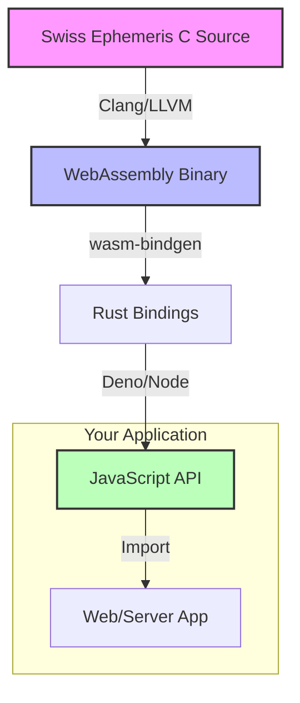

# @fusionstrings/swiss-eph

> **Professional Grade Astrology for the Modern Web.**\
> _Bit-perfect Swiss Ephemeris precision, compiled for everywhere._

[](https://crates.io/crates/swiss-eph)
[](https://docs.rs/swiss-eph)
[](https://jsr.io/@fusionstrings/swiss-eph)
[](LICENSE)

**SwissEph** empowers developers to build high-precision astrological
applications without compromise. We bring the industry-standard Swiss Ephemeris
(C library) to the JavaScript ecosystem with zero loss in accuracy and
native-tier performance.

## Why SwissEph?

### 🎯 Uncompromising Precision

Don't settle for approximations. We allow you to run the **exact same code**
used by professional astrological software. Our WASM build is compiled directly
from the official C source, ensuring bit-level parity with the reference
implementation.

### 🚀 Native Performance

Powered by **WebAssembly** and optimized Rust bindings, SwissEph runs at
near-native speeds. Calculate planetary positions for thousands of dates in
milliseconds.

### 🌐 Universal Compatibility

Write once, run everywhere. We support a complete **3x2x4 Integration Matrix**:

- **Platforms**: Deno, Node.js, Browsers, Cloudflare Workers
- **Builds**: `wasmbuild` (High-level Rust) & `wasi` (Direct C)
- **Styles**: Standard API, Direct WASM, or Inline (Zero-request)

## Architecture



## Quick Start

### JavaScript / TypeScript

Install from JSR (works with Deno, npm, pnpm, yarn):

```bash
deno add @fusionstrings/swiss-eph
# or
npx jsr add @fusionstrings/swiss-eph
```

Calculate the Sun's position in 3 lines of code:

```typescript
import { Constants, load } from "@fusionstrings/swiss-eph";

// 1. Initialize
const swisseph = await load();

// 2. Calculate Julian Day (UTC)
const jd = swisseph.swe_julday(2024, 1, 1, 12.0, Constants.SE_GREG_CAL);

// 3. Get Position
const { xx } = swisseph.swe_calc_ut(
  jd,
  Constants.SE_SUN,
  Constants.SEFLG_SPEED,
);

console.log(`Sun Longitude: ${xx[0].toFixed(6)}°`);
```

### Rust

Add to `Cargo.toml`:

```toml
[dependencies]
swiss-eph = "0.1"
```

```rust
use swisseph::safe::{self, CalcFlags, Planet};

fn main() {
    let jd = safe::julday(2024, 1, 1, 12.0); // Gregorian by default
    let flags = CalcFlags::new().with_speed();
    let sun = safe::calc_ut(jd, Planet::Sun.to_int(), flags.raw()).unwrap();
    println!("Sun Longitude: {:.6}°", sun.longitude);
}
```

## Comparisons & Benchmarks

We take performance seriously.

| library                 | implementation | speed (ops/sec) |         note         |
| :---------------------- | :------------- | :-------------: | :------------------: |
| **swiss-eph (Direct)**  | **WASM (Raw)** | **~6,200,000**  | **Peak Performance** |
| **swiss-eph (Node JS)** | **WASI (JS)**  | **~1,200,000**  |  **Typical Server**  |
| **swiss-eph (Deno JS)** | **WASM (JS)**  |  **~540,000**   |  **Modern Runtime**  |
| ephemeris               | Pure JS        |     ~45,000     |    Low Precision     |

> _Benchmarks run on Apple M1 Max._

## Documentation & Resources

- **[Examples](./examples/)**: Comprehensive integration recipes for Deno, Node,
  Browser, and Workers.
- **[Integration Matrix](./EXAMPLES.md)**: Detailed breakdown of all 72
  supported configuration permutations.
- **[Rust Crate](./crates/swiss-eph/)**: Documentation for the Rust bindings.
- **[Official Docs](https://www.astro.com/swisseph/)**: The authoritative
  reference for the underlying C library.

## License

**AGPL-3.0**. This project is a derivative work of the
[Swiss Ephemeris](https://www.astro.com/swisseph/) by Astrodienst AG. We honor
their open-source contributions by maintaining the same license.
