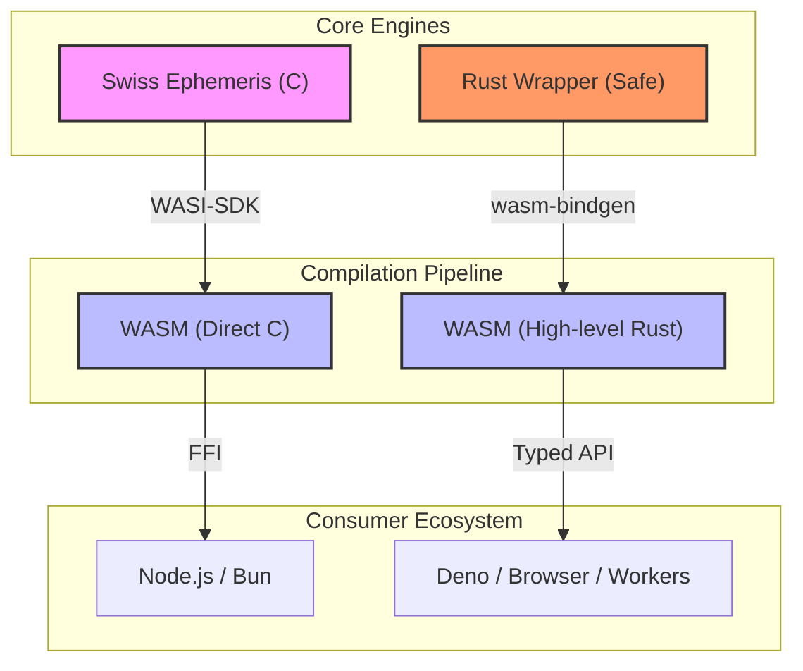

# @fusionstrings/swiss-eph

> **Professional Grade Astrology for the Modern Web.**\
> _Bit-perfect Swiss Ephemeris precision, compiled for everywhere._

[](https://crates.io/crates/swiss-eph)
[](https://docs.rs/swiss-eph)
[](https://jsr.io/@fusionstrings/swiss-eph)
[](LICENSE)

**SwissEph** is the industry-standard Swiss Ephemeris (C library) brought to the
modern JavaScript and Rust ecosystems. We provide high-precision astrological
calculations with zero loss in accuracy and native-tier performance across all
platforms.

## ✨ Key Features

- **🎯 Uncompromising Precision**: Bit-level parity with the official Swiss
  Ephemeris C source.
- **🚀 Native-Tier Speed**: Powered by WebAssembly and optimized Rust bindings.
  Calculate thousands of positions in milliseconds.
- **🌐 Universal Runtime**: First-class support for **Deno**, **Node.js**,
  **Browsers**, and **Cloudflare Workers**.
- **📦 Multi-Build Strategy**: Choose between high-level `wasmbuild` (safe Rust)
  or direct `WASI` (raw C) bindings.
- **🛠️ Flexible Deployment**: Support for Standard API, Direct WASM
  instantiation, or Zero-Config Inline builds.

## 🏗️ Architecture



## Quick Start

### JavaScript / TypeScript

Install from JSR (works with Deno, npm, pnpm, yarn):

```bash
deno add @fusionstrings/swiss-eph
# or
npx jsr add @fusionstrings/swiss-eph
```

Calculate the Sun's position in 3 lines of code:

```typescript
import { Constants, load } from "@fusionstrings/swiss-eph";

// 1. Initialize
const swisseph = await load();

// 2. Calculate Julian Day (UTC)
const jd = swisseph.swe_julday(2024, 1, 1, 12.0, Constants.SE_GREG_CAL);

// 3. Get Position
const { xx } = swisseph.swe_calc_ut(
  jd,
  Constants.SE_SUN,
  Constants.SEFLG_SPEED,
);

console.log(`Sun Longitude: ${xx[0].toFixed(6)}°`);
```

### Rust

Add to `Cargo.toml`:

```toml
[dependencies]
swiss-eph = "0.1"
```

```rust
use swisseph::safe::{self, CalcFlags, Planet};

fn main() {
    let jd = safe::julday(2024, 1, 1, 12.0); // Gregorian by default
    let flags = CalcFlags::new().with_speed();
    let sun = safe::calc_ut(jd, Planet::Sun.to_int(), flags.raw()).unwrap();
    println!("Sun Longitude: {:.6}°", sun.longitude);
}
```

## ⚡ Performance

We take performance seriously. Our WASM implementation rivals native
performance.

| Library                 | Implementation | Speed (ops/sec) | Note                          |
| :---------------------- | :------------- | :-------------: | :---------------------------- |
| **swiss-eph (Direct)**  | **WASM (Raw)** | **~6,200,000**  | **Peak Performance**          |
| **swiss-eph (Node JS)** | **WASI (JS)**  | **~1,200,000**  | **Typical Server**            |
| **swiss-eph (Deno JS)** | **WASM (JS)**  |  **~540,000**   | **Modern Runtime**            |
| ephemeris               | Pure JS        |     ~45,000     | Low Precision / Approximation |

> [!NOTE]
> Benchmarks performed on Apple M1 Max. Results vary by runtime and ephemeris
> data source.

## Documentation & Resources

- **[Verification Matrix](./MATRIX.md)**: Full 72-path decision tree,
  statecharts, and benchmarks.
- **[Examples](./examples/)**: Comprehensive integration recipes for Deno, Node,
  Browser, and Workers.
- **[Integration Matrix](./EXAMPLES.md)**: Detailed breakdown of all 72
  supported configuration permutations.
- **[Rust Crate](./crates/swiss-eph/)**: Documentation for the Rust bindings.
- **[Official Docs](https://www.astro.com/swisseph/)**: The authoritative
  reference for the underlying C library.

## License

**AGPL-3.0**. This project is a derivative work of the
[Swiss Ephemeris](https://www.astro.com/swisseph/) by Astrodienst AG. We honor
their open-source contributions by maintaining the same license.
